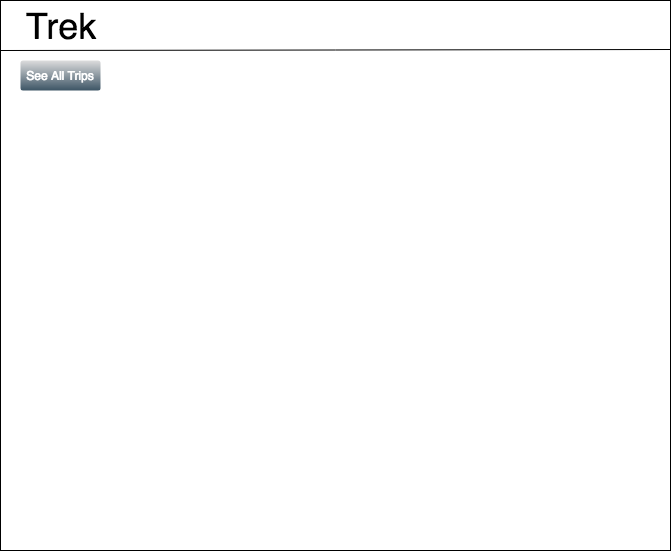
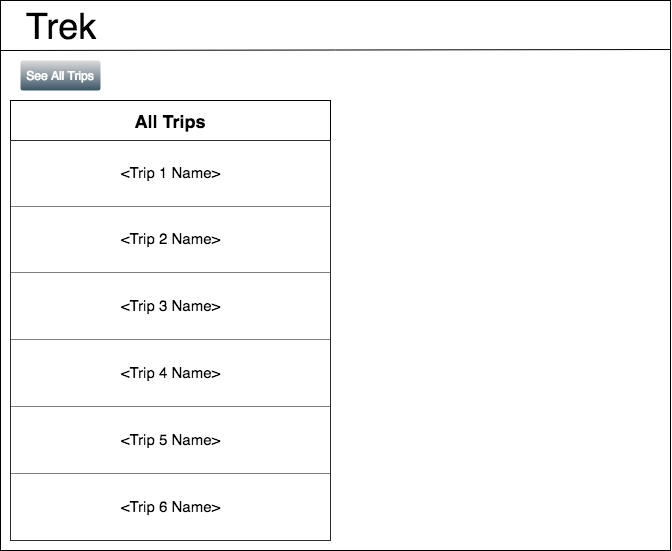
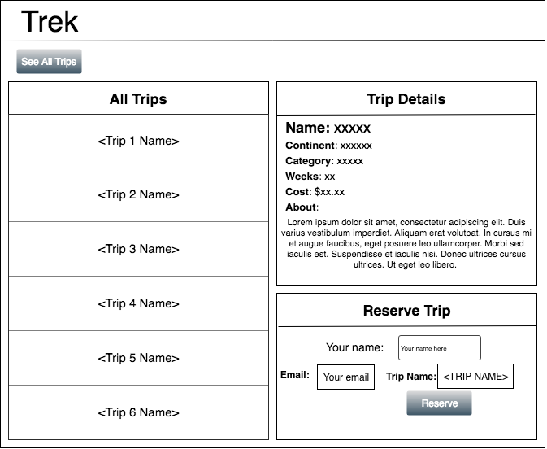

# TREK

## At a Glance

- Individual, [stage 2](https://github.com/Ada-Developers-Academy/pedagogy/blob/master/rule-of-three.md) project
- Due before class, Monday June 3rd

TREK is an application that displays information on travel packages and allows users to reserve spots on a specific trip.

## Learning Goals

- Reading data from an API using axios
- Posting data to an API using axios
- Building dynamic elements on a page with jQuery

## Objective

You will build a web app that will query data from an api, using axios, to display a list of trips and view more information on a specific trip. While viewing a specific trip, you can claim your spot by sending data back to the API.

All of this should be done without ever having to reload the page. In other words, TREK will be a single page application and will only need one html page, `index.html`.

## The API

This project will use Ada's Travel API. Read about its usage on the [Travel API's documentation](https://github.com/AdaGold/trip_api).

## Non-Functional Requirements

- Any errors encountered while interacting with the API must be politely reported to the user
- Use HTML best-practices. Use semantic HTML tags to group and organize your HTML appropriately
- The site should be attractively styled, using CSS Grid, flexbox, and/or Bootstrap

## Functional Requirements

### Wave 1

- As a user on the home page with no trips listed, I want to click a button or link, so that I see a list of all trips.

### Wave 2

- As a user on the home page with trips listed, I want to click on a specific trip, so that I see a new section appear with details of that trip.
- As a user on the home page, after I've selected a specific trip, I want to see the following fields listed in the new section of the page, so that I know the details of that trip:
  - Trip ID
  - Trip name
  - Continent
  - Details about the trip
  - Category of the trip
  - Number of weeks duration of the trip
  - Cost of the trip

### Wave 3

- As a user on the home page, after I've selected a specific trip, I want to see a form I can use to fill out details, so that I can submit a reservation to this trip
- As a user on the home page, after I've selected a specific trip, I want to use the form to fill out the following details, so that I can submit my information with this reservation:
  - name
  - email

## Optional Wireframes
You have creative control over the design and layout of this project. Below are optional wireframes you may use. It is not a requirement that you do.

**Base Page**

As a user, I want to arrive to a site with no trips listed, so that I can admire the beautiful, negative space:

**See All Trips**

As a user on the home page with no trips listed, I want to click a button or link, so that I see a list of all trips:

**Click a Trip**

As a user on the home page with trips listed, I want to click on a specific trip, so that I see a new section appear with details of that trip.

As a user on the home page, after I've selected a specific trip, I want to see a form I can use to fill out details, so that I can submit a reservation to this trip

<!-- https://www.draw.io/#G1n5hDq4YfmeGtHQ9U0Cx0aZWyeUqNxq9B -->

## Optional Enhancements

- **For more practice working with data**, filter trips by search queries (like by continent, budget, etc.). You'll need to explore the API to see what functionality exists.
- **To practice a more advanced POST**, allow the user to create a new trip.
- **For more jQuery practice**, use jQuery to sort list of trips by specific attributes, like budget or time remaining.

## What Instructors Are Looking For
Check out the [feedback template](feedback.md) which lists the items instructors will be looking for as they evaluate your project.
